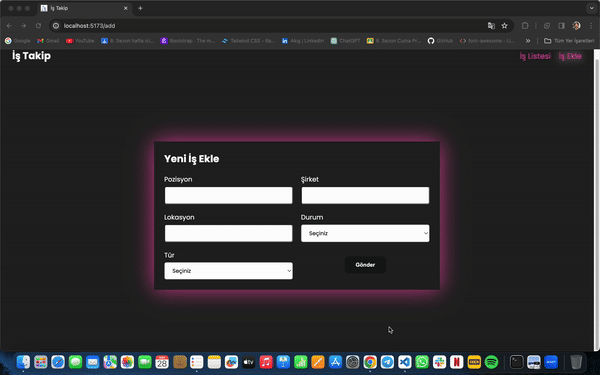

# Kütüphaneler

- react-router-dom
- axios
- sass
- react-toastify
- json-server
- react-redux
- @reduxjs/toolkit
- uuid
- react-icons

# jobApp

🔍 Yaptığımız iş görüşmelerini takip etmek ve yönetmek için mükemmel bir çözüm geliştirdik. React ile oluşturduğumuz bu uygulama, iş arama sürecini daha kolay ve verimli hale getirmek için bir dizi modern teknolojiyi bir araya getiriyor.

✅ json-server ile basit ve hızlı bir API oluşturarak verileri yönetiyoruz.

⚡️ React Router DOM sayesinde kullanıcı dostu bir arayüz ile sayfalar arası geçişler sağlıyoruz.

📡 Axios ile API istekleri atarak gerçek zamanlı verilere ulaşıyoruz.

🔄 Redux ve @reduxjs/toolkit kullanarak uygulamanın durumunu merkezi bir depoda saklayıp yönetiyoruz.

🎨 Sass ile modern ve duyarlı bir kullanıcı arayüzü tasarlıyoruz.

🌟 react-toastify ile görsel olarak kaliteli bildirimler sağlıyoruz.

🔑 uuid ile benzersiz ID'ler oluşturarak veri bütünlüğünü sağlıyoruz.

🎉 react-icons ile görsellik ve kullanılabilirlik artırıyoruz.

👨‍💼 Bu uygulama, iş arama sürecini kolaylaştırmak ve iş görüşmelerini takip etmek için tasarlandı. Artık iş listesini filtreleyerek istediğiniz bilgilere hızlıca erişebilir ve düzenleyebilirsiniz.

# ScreenShot

